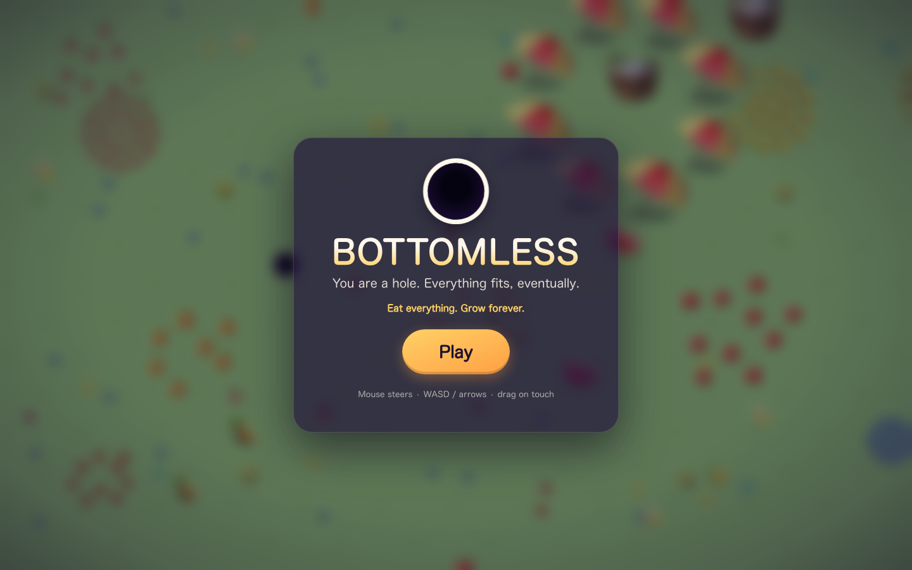
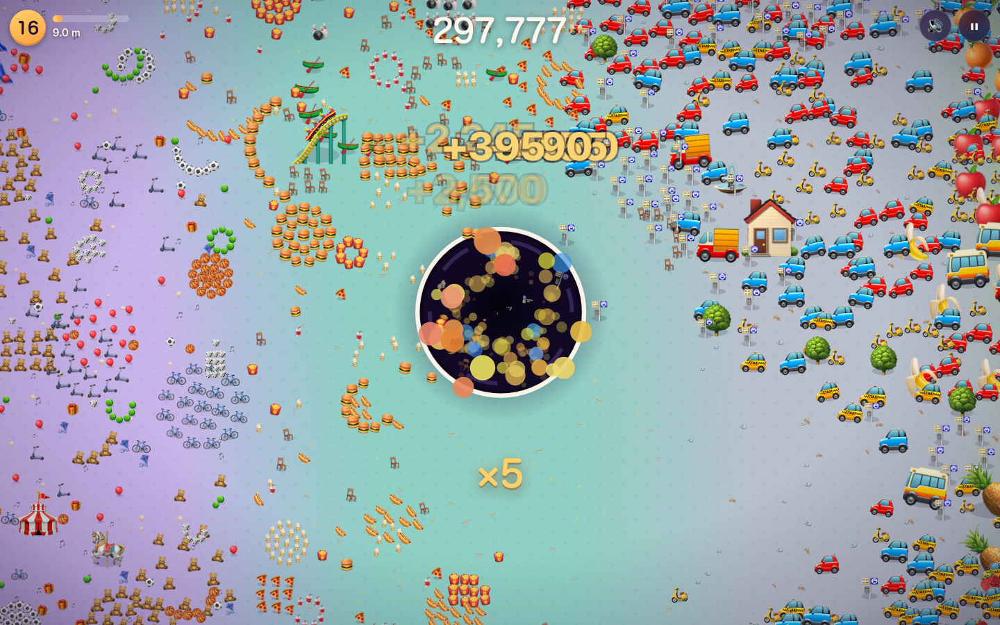

# Bottomless

**You are a hole. Everything fits, eventually.**

An endless, single-player hole-swallowing game for the web. Roll over a candy-colored world eating berries, cakes, toys, cars and whole city blocks — and grow. The world is procedurally generated and infinite: the further you roam, the bigger everything gets. No timer, no death, no end. Just the hole.



## Play

```bash
npm run serve        # or: python3 -m http.server 8137
# open http://localhost:8137
```

Static vanilla JS — no build step, no runtime dependencies, no assets to download. Emoji are the art; the sounds are synthesized in WebAudio on the fly.

**Controls:** the hole follows your mouse. WASD / arrow keys work too. On a phone, drag your finger. `Esc` or `P` pauses.

## How it works

- **Fit and swallow.** Anything smaller than the hole gets vacuumed in when you pass over it. Anything bigger just sits there — for now. Almost-fitting objects pulse a white ring: *grow a bit more*.
- **Growth is area.** The hole's area absorbs a fraction of everything it eats, so pacing feels the same whether you're eating blueberries or apartment buildings.
- **Biome bands.** The world radiates outward from spawn: Berry Meadow → Orchard Grove → Sugar Bakery → Toybox Town → Funfair Boardwalk → Downtown. After Downtown the cycle repeats as *Berry Meadow II* — with everything six times larger.
- **Combos.** Fast consecutive swallows build a ×2…×5 multiplier.
- **Deterministic worlds.** Every run has a seed (`?seed=whatever` to pin one); the same seed always generates the same world. Eaten objects stay eaten.




## Development

```bash
npm test             # unit tests: engine (rng, world gen, growth, swallow, camera)
npm run test:e2e     # Playwright: boots the game, steers, swallows, checks mobile
```

The engine is headless — world generation, growth, and swallow rules are pure modules driven by the same API the browser uses. See [CLAUDE.md](CLAUDE.md) for the architecture map.

## License

MIT © Owen Wang
