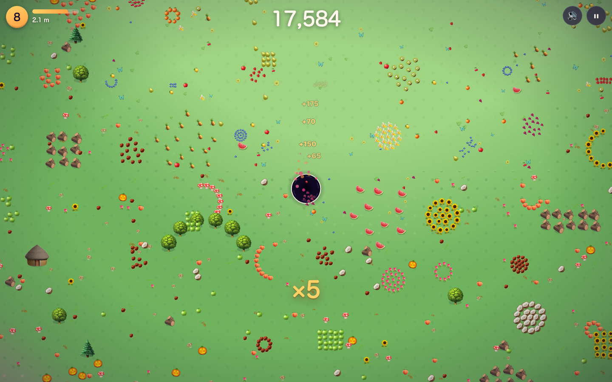
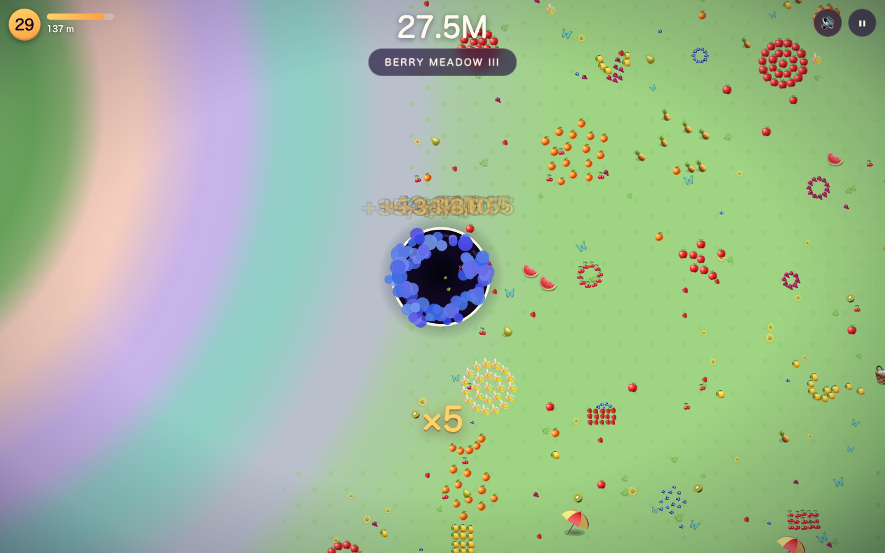

<p align="center">
  
</p>

# Hole Foods

**You are a hole. Everything fits, eventually.**

<p align="center">
  
  
  
</p>

---

An endless hole-swallowing game for the web. Steer a hole across a candy-colored world, vacuum up anything that fits — berries, cakes, teddy bears, taxis, apartment blocks — and grow. There's no timer, no death, no end. Just appetite.

- **Fractal world**: the game plays identically at 44 cm and 800 m. Biomes, food spacing, camera zoom, and effects all scale together, forever.
- **Procedural and deterministic**: infinite seeded terrain (`?seed=anything` pins a world); what you eat stays eaten.
- **Zero anything**: no build step, no runtime dependencies, no asset files. Emoji are the art; the sounds are synthesized in WebAudio at play time.
- **Plays everywhere**: mouse, WASD/arrows, or touch. Desktop and phone.



Roam far enough and the cycle repeats one size up — your entire first world shrinks to a bullseye behind you:




## Play

```bash
git clone https://github.com/maninae/hole-foods.git
cd hole-foods && npm run serve   # or: python3 -m http.server 8137
```

Open http://localhost:8137. The hole follows your mouse; <kbd>Esc</kbd> pauses.

## How it works

| Mechanic | Rule |
|----------|------|
| Swallowing | Objects fitting inside the hole get vacuumed in; too-big ones pulse a ring: *grow a bit more* |
| Growth | Hole area absorbs a fraction of everything eaten — pacing feels the same at every scale |
| Combos | Swallows ≤ 1.8 s apart stack a ×2…×5 multiplier |
| Biomes | Berry Meadow → Orchard Grove → Sugar Bakery → Toybox Town → Funfair Boardwalk → Downtown, then again at 6× size ("Berry Meadow II"), forever |

The endless part is a fractal invariant: biome bands widen geometrically, world chunks come in per-cycle sizes, and the camera zooms out without bound — so on-screen density, speed, and effects stay constant no matter how huge you get.

## Development

```bash
npm test             # unit tests — headless engine (world gen, growth, swallow, fractal invariants)
npm run test:e2e     # Playwright — real steering, swallowing, mobile layout
```

Architecture, invariants, and gotchas live in [CLAUDE.md](CLAUDE.md); design rationale in [docs/superpowers/specs/](docs/superpowers/specs/2026-07-02-hole-foods-design.md).

## License

MIT © Owen Wang
