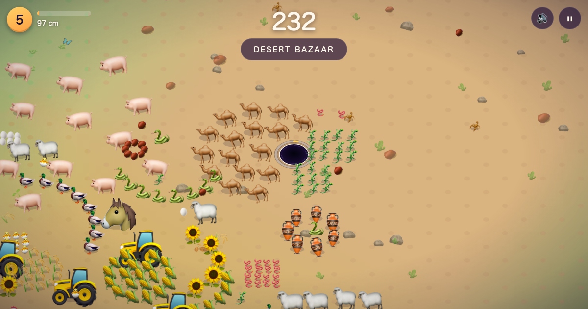
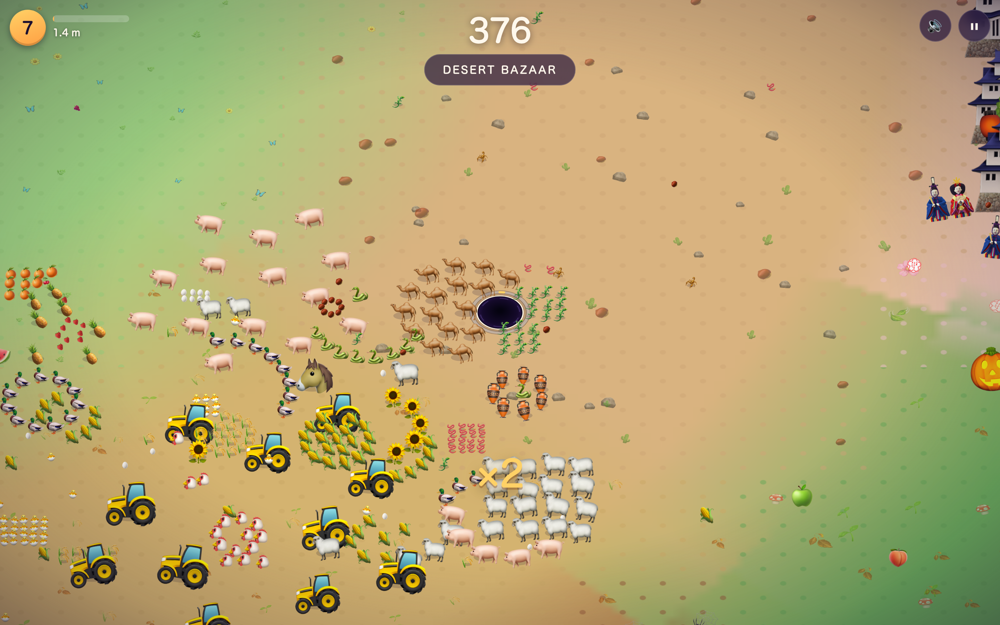
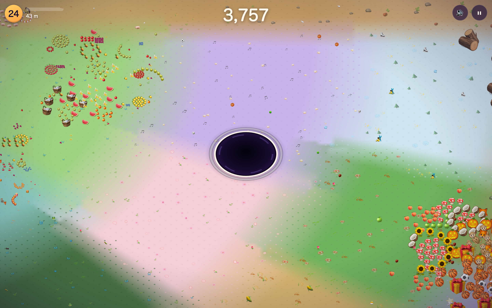
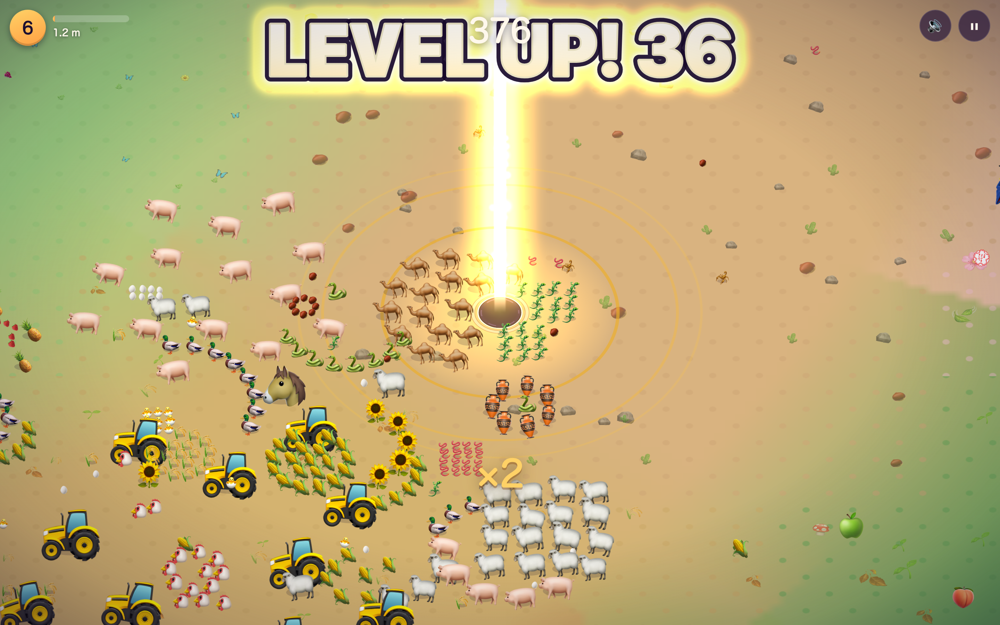
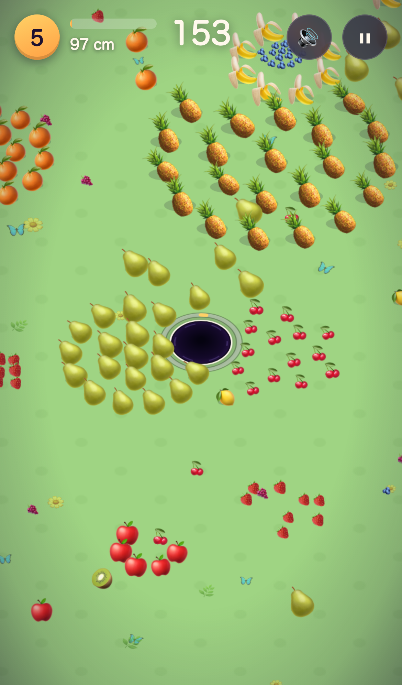

<p align="center">
  
</p>

# Hole Foods

**You are a hole. Everything fits, eventually.**

<p align="center">
  
  
  
</p>

An endless single-player hole game for the web. Park your rim under a snack until it teeters and drops. Grow one discrete step at a time. Roam far enough and the world you started in becomes a bullseye behind you, at 1/6 scale, and again, forever.



## Play

```bash
git clone https://github.com/maninae/hole-foods.git
cd hole-foods && npm run serve      # or: python3 -m http.server 8137
```

Open http://localhost:8137. **Arrow keys / WASD** steer on desktop; **drag** on phone. <kbd>Esc</kbd> or <kbd>P</kbd> pauses.

Pin a world with `?seed=anything` — the same seed reproduces the same terrain and cluster layouts. `?seed=photogenic` is the world in every screenshot here.

## What it does

- **Rim physics, not vacuum.** Objects sit inert until your edge slides under them. Past 30% overhang they teeter; past 50% their center loses support and they tip in. No long-range attraction anywhere.
- **Isometric ground plane.** The world is drawn in a shallow pseudo-3D: the ground Y-squashes to 0.72, the hole reads as an ellipse, everything else stands upright on it and y-sorts behind you.
- **Discrete size ladder.** Your radius always sits exactly on the ladder — 22 cm to boundless in ×1.22 steps (roughly +49% area per rung). Each level-up unlocks a whole row of new-to-you edibles at once.
- **Level-up celebration.** Expanding aura, ground rings, a sky-piercing pillar, and an overshooting "LEVEL UP! N" title. The color climbs a ladder as you level: sky-blue → azure → lavender → royal purple → yellow → **gold** → pale green → emerald. Every 10th level adds a full-screen wash.
- **Oasis/desert distribution.** Food comes in 3×3-chunk patches. An oasis is a rich cluster of a single theme's items; between them you cross sparse ground with the odd giant sighting until the next cluster.
- **Angular patchwork world.** 18 themes tile the world as roughly-square angular sectors — walk sideways and you cross into a different theme without leaving your size band. Only distance from origin decides the scale tier; angle decides the theme.
- **Fractal endless scaling.** Every 6 bands the world's size multiplier steps ×6 — biome widths, chunk sizes, item radii, and camera zoom all scale together. Play stays identical at 44 cm, 44 m, and 44 km.
- **BigInt scoring.** Score is exact-integer end-to-end (BigInt in code, `56.0M`/`4.2B`-style in the HUD). No wraparound at any depth.
- **Keys / touch only.** No mouse-tracking, no auto-aim. Arrow keys, WASD, or touch drag.
- **Zero assets.** No build, no runtime dependencies, no images or audio files. Emoji are the art; WebAudio synthesizes every pop, gulp, and level-up chime at play time.

## Themes

The 18 themes tile the world as an angular patchwork. Cycle 1 traverses in the classic six-biome order (Berry Meadow → Downtown); after that, the sector-hash keeps producing surprise pairings all the way out.

| Theme | Ground | A few of its things |
|-------|--------|---------------------|
| Berry Meadow | soft green | 🫐 🍓 🍉 🧺 |
| Orchard Grove | rich green | 🌰 🍄 🎃 🌳 |
| Sugar Bakery | pink cream | 🍬 🧁 🍰 🎂 |
| Toybox Town | lavender | 🎲 🧸 🎠 🎪 |
| Funfair Boardwalk | teal | 🍦 🍔 🎢 🎡 |
| Downtown | slate | 🛵 🚕 🏠 🏢 |
| Halloween Haunt | pumpkin brown | 🕷️ 👻 🪦 🏚️ |
| Ocean Depths | deep blue | 🐚 🐙 🦈 🚢 |
| Safari Savanna | dry gold | 🦔 🦓 🐘 🦒 |
| Cosmic Void | indigo | ⭐ 🌙 🪐 🛸 |
| Chalkboard Academy | chalk green | ✏️ 📚 🎓 🏫 |
| Winter Wonderland | ice blue | ❄️ ⛄ 🎄 🏔️ |
| Sakura Garden | pale pink | 🌸 🍡 🏮 ⛩️ |
| Music Hall | wine red | 🎵 🎤 🎹 🎭 |
| Farm Country | wheat gold | 🥚 🌽 🐄 🚜 |
| Jungle Ruins | jungle green | 🦋 🐍 🐆 🛕 |
| Desert Bazaar | sandstone | 🌰 🦂 🐪 🕌 |
| Robot Factory | steel grey | 🔩 🤖 🏗️ 🏭 |

## The endless part



Every 6 bands, the world resets one size up. Biome bands widen ×6, chunks widen ×6, item radii multiply ×6. The camera zooms out on the same law that grows the hole, so on-screen density stays constant. The Berry Meadow you started in is still out there — as a 260 m ring behind you.

Chunks are generated deterministically from `(seed, cycle, cx, cy)` and eaten objects are remembered per chunk, so unloading and reloading doesn't respawn what you ate.

## Level-up



Each rung of the ladder gets a celebration. Every 10th level (10, 20, 30, ...) is a milestone with extra ring pulses and a screen-wide flash tinted the aura's current color. Reduced-motion users get the sound and the badge; everything else fades out.

## Mobile



Portrait layout, drag anywhere to steer. Same engine, same fractal invariants; the HUD collapses onto a single top row.

## Development

```bash
npm test             # unit tests — headless engine (fractal invariants, growth, swallow, catalog, rim physics)
npm run test:e2e     # Playwright — steer → teeter → tip → grow, pause/mute/best persistence, mobile
npm run sim -- 12    # headless greedy-bot balance sim (12 minutes; passes seeds as trailing args)
```

Architecture, invariants, and gotchas live in [CLAUDE.md](CLAUDE.md); design rationale in [docs/superpowers/specs/](docs/superpowers/specs/2026-07-02-hole-foods-design.md).

## License

MIT © Owen Wang
